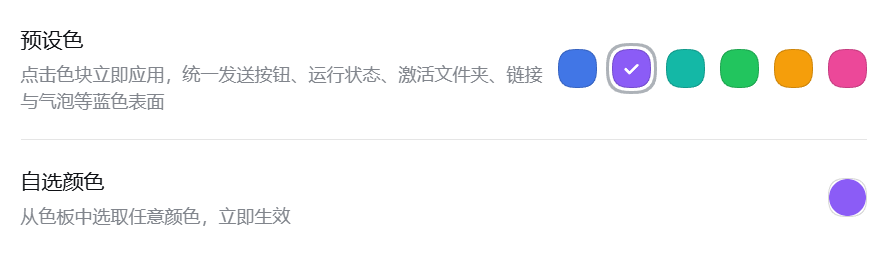

# dsh-the-color

[中文](README.md) | English

A dsh plugin that unifies the DeepSeek Harness theme color in one click: it adds a **Theme color** section in Settings — a sibling of "General" — with six preset swatches and a color-well picker; clicking or picking applies instantly. The color overrides the deepseek blue family in the `@deepseek-ai/dsh-client-ui-theme` base palette, so the send button, running-status animation and text, active workspace folder, links, bubbles, and every other blue surface move together.

**Zero-diff by default**: with "Default" selected (or no accent stored) no override layer is stacked — the UI stays byte-identical to the stock palette, as if the plugin were never installed.



## Usage

Settings (left navigation) → **Theme color**:

* **Presets**: Default / Violet / Teal / Green / Amber / Rose — click a swatch to apply instantly; "Default" restores the stock palette
* **Custom color**: the round color-well button opens the native picker; the picked color applies immediately
* A custom accent set from the console shows up as an extra "Custom" swatch in the preset row

Custom accent (console/script): `localStorage.setItem('dsh-the-color:accent', '#7c3aed')` then reload; `removeItem` restores the default.

## Coverage

| Group        | Variables                                                                                                                                 | Affected UI                                                                                                                                                                                                         |
| ------------ | ----------------------------------------------------------------------------------------------------------------------------------------- | ------------------------------------------------------------------------------------------------------------------------------------------------------------------------------------------------------------------- |
| Family       | `--dsw-static-deepseek-50/100/200/300/400/450/500/800/900`                                                                                | Send/stop button, running whale and the "Deep diving" text (including shimmer mixes), links, active folder, user bubble and highlight, sidebar active tint, business state dots, default file-type icon, Toast icon |
| Mix partners | `--dsw-static-blue-950`, `--dsw-static-blue-300` (the deep-diving and shimmer mixes), `--dsw-static-blue-450` (ContextMeter message tint) | Running-status animation colors, context usage ring                                                                                                                                                                 |
| Stray alias  | `--dsw-alias-brand-primary-new-colorprimary-new-color` (hardcoded in the light palette; does not follow the palette)                      | dockkit background, Settings update notice, account notice icon, trajectory cell gradient                                                                                                                           |

Deliberately not covered: `--dsw-static-blue-500` (document selection, trajectory chart gradient), `--dsw-static-blue-900` (HeroShell heading), the desktop-shell static pages (the hardcoded `#4d6bfe` in `apps/desktop/renderer/*.css`), and ANSI terminal colors (semantic).

## Install

    dsh plugin --profile <profile> add xxxx\dsh-the-color

Restart the app (or wait for HMR); `dsh plugin --profile <profile> remove dsh-the-color` fully reverts.

## Mechanism

* **Official override channel**: `ctx.theme.overrideTokens('dsh-the-color', tokens)` — the token-override layer provided by ui-theme. ui-layout's presenter writes it as **inline CSS variables on body** and retracts its own previous set — it beats every stylesheet definition by nature, and theme/light-dark switching is handled for you; calling again with the same source replaces the whole layer, disposed through `ctx.effect` on unload.
* **No layer by default**: with no accent stored the override is never called, so the UI stays unchanged.
* **Shade derivation**: the family shares the accent's hue; `deepseek-500` is the accent verbatim (core surfaces match the picked color byte-for-byte); the remaining steps use fixed lightness targets and saturation factors calibrated against the stock palette (feeding the stock 500 keeps the deepseek family within Δ7 per channel; the `blue-*` mix partners sit at a slightly different stock hue, so unifying the hue moves them a bit further — expected).
* **Settings section**: registered into the `settings.section` slot (`id: theme-color`, `order: 5` — right after General at 0, before Models at 10); the nav label is the locale-following thunk `label: () => t('themeColor.nav')`; page styles are injected through `ctx.effect` and scoped by `data-dsh-theme-color-page`; copy is registered through `ctx.locale` (namespace `settings.theme-color`, zh/en dictionaries).

## Structure

    dsh-the-color/
    ├── package.json        # dsh.bundle.patch (cordis.patch.yml) + dsh.client(web) + icon + locale exports
    ├── cordis.patch.yml    # inserts the Loader row id: theme-color
    ├── index.js            # Host half: inert row (lets client-modules discover the manifest)
    ├── client.js           # Browser half: pre-built lazy module (ctx.theme override layer + settings section)
    ├── icon.svg            # Plugins-page icon (36×36 three-color wheel: blue/amber/violet)
    ├── locale/             # Plugins-page display metadata (zh/en, meta.title + meta.description)
    └── tools/check-client.mjs

The browser half is hand-written in the repo's `clientBundle` dynamic-bundle format (`window.__ModuleLoader__.load({id, factory})` CJS closure); the host scans each row's `dsh.client` manifest and serves the file as-is. The component takes `react` from the module-table baseline, receives its business capabilities through the `inject` face, and registers copy through `ctx.locale`.
